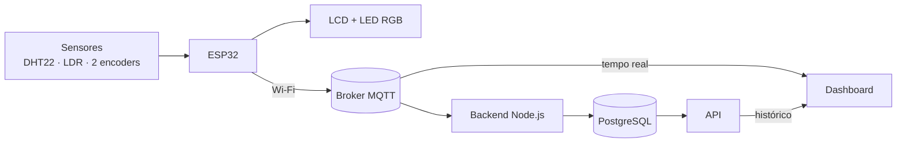

<div align="center">

# Aeolus — Estação Meteorológica IoT

**Temperatura, umidade, luminosidade, velocidade e direção do vento em tempo real**


Vortex Lab — Universidade de Fortaleza (UNIFOR) · Programa de Estágio em IoT

</div>

---

## Sumário

- [Visão geral](#visão-geral)
- [Estado atual](#estado-atual)
- [Arquitetura](#arquitetura-do-sistema)
- [Tecnologias e componentes](#tecnologias-e-componentes)
- [Pinagem final](#pinagem-final)
- [Funcionamento dos componentes](#funcionamento-dos-componentes)
- [Comunicação MQTT](#comunicação-mqtt)
- [Backend, banco e histórico](#backend-banco-de-dados-e-histórico)
- [Estrutura do projeto](#estrutura-do-projeto)
- [Como executar](#configuração-e-execução)
- [Testes](#testes-realizados)
- [Limitações e melhorias futuras](#limitações-e-melhorias-futuras)
- [Identidade do projeto](#identidade-do-projeto)
- [Versionamento e autoria](#versionamento)

---

## Visão geral

O Aeolus utiliza um ESP32 para coletar dados do ambiente, apresentá-los localmente e enviá-los para uma dashboard. O projeto reúne sistemas embarcados, eletrônica, comunicação MQTT, desenvolvimento web, banco de dados e fabricação digital.

O nome faz referência a Éolo, figura da mitologia grega associada aos ventos. Essa identidade aparece na caixa da estação ("O Odre de Aeolus"), na dashboard ("Templo de Aeolus") e na classificação visual da velocidade do vento (Escala Aeolus).

## Estado atual

Os componentes foram testados individualmente na montagem e reunidos no firmware principal. O funcionamento geral da integração foi confirmado pela equipe em **7 de outubro de 2026**.

As alterações foram enviadas ao GitHub seguindo o fluxo:

**`feature/integracao-final` → `develop` → `main`**

Em **8 de outubro de 2026**, foram feitas estas atualizações:

- Troca do módulo LDR por um com resposta analógica gradual;
- Conversão da leitura do LDR para uma **estimativa de iluminância em lux**;
- Relógio do LCD sincronizado por NTP, em UTC−3;
- Dashboard ajustada para exibir a luminosidade em lux;
- `GET /api/status` retornando servidor online e banco conectado;
- Gráfico da dashboard atualizando.

Todas as funções foram testadas pela equipe e estão funcionando: gravação no PostgreSQL, histórico, luminosidade em lux na dashboard e bússola da direção do vento.

A estimativa de lux, a calibração física dos encoders e as demais limitações estão descritas neste documento.

## Objetivo

Desenvolver uma estação capaz de acompanhar:

- Temperatura ambiente;
- Umidade relativa do ar;
- Luminosidade estimada em lux;
- Velocidade do vento;
- Direção do vento.

Os dados são apresentados no LCD, representados pelo LED RGB e publicados por Wi-Fi e MQTT.

A dashboard recebe as leituras em tempo real. O backend permite armazenar os registros no PostgreSQL e disponibilizá-los por uma API para consulta do histórico.

## Tecnologias e componentes

| Área | Tecnologias e componentes |
|---|---|
| Controle | ESP32 DevKit V4 |
| Firmware | C/C++, framework Arduino e PlatformIO |
| Sensores | DHT22, módulo LDR e dois encoders KY-040 |
| Interface local | LCD 16x2 I2C, LED RGB e dois botões frontais |
| Comunicação | Wi-Fi, MQTT, JSON e PubSubClient |
| Backend | Node.js, Express e MQTT.js |
| Banco de dados | PostgreSQL |
| Dashboard | HTML, CSS, JavaScript, MQTT.js e Chart.js |
| Desenvolvimento | VS Code, Git e GitHub |
| Fabricação | KiCad, PCB artesanal e peças impressas em 3D |

O firmware utiliza as bibliotecas **DHT sensor library** e **LiquidCrystal_I2C**.

As dependências do firmware e do backend são declaradas em `platformio.ini` e `backend/package.json`, respectivamente.

## Pinagem final

Placa utilizada: **ESP32 DevKit V4**.

| Componente | Sinal | GPIO | Função |
|---|---|---:|---|
| DHT22 | DATA | 4 | Leitura de temperatura e umidade |
| LDR | Sinal analógico | 35 | Leitura com `analogRead` e estimativa em lux |
| RGB | Vermelho | 26 | Controle do canal vermelho |
| RGB | Verde | 25 | Controle do canal verde |
| RGB | Azul | 33 | Controle do canal azul |
| LCD I2C | SDA | 13 | Comunicação de dados |
| LCD I2C | SCL | 14 | Clock |
| Anemômetro/cata-vento | CLK | 16 | Canal de quadratura |
| Anemômetro/cata-vento | DT | 17 | Canal de quadratura |
| Anemômetro/cata-vento | SW | 19 | Referência do rotor para o cálculo |
| Biruta | CLK | 21 | Canal de quadratura |
| Biruta | DT | 27 | Canal adicionado durante os testes finais |
| Biruta | SW | 22 | Calibração da referência Norte |
| Botão frontal direito | Sinal | 32 | Liga e desliga somente o LCD |
| Botão frontal esquerdo | Sinal | 23 | Troca manualmente as páginas do LCD |

O LCD utiliza o endereço I2C **`0x27`** e é inicializado com `Wire.begin(13, 14)`.

O GPIO18 não é utilizado na montagem atual. Os botões são configurados com `INPUT_PULLUP`, com acionamento em nível baixo.

No teste físico do RGB, **LOW desligou e HIGH acendeu** os canais. Por isso, o código atual utiliza PWM sem inversão.

## Funcionamento dos componentes

### Temperatura e umidade

O DHT22, conectado ao GPIO4, fornece temperatura em graus Celsius e umidade relativa em porcentagem.

No firmware integrado, as leituras dos sensores são realizadas a cada **2,5 segundos**.

O módulo trata resultados inválidos e retorna `-1` quando ocorre uma falha de leitura. Esse valor exige cuidado na interpretação da temperatura, pois −1 °C também pode ser uma medição real.

### Luminosidade

O firmware lê o LDR com `analogRead` no GPIO35, com resolução de 12 bits (0 a 4095).

**Módulo anterior:** a saída ficava próxima de 0 com luz e chegava a 4095 com o sensor coberto, quase sem valores intermediários. A transição abrupta indicava que o módulo funcionava como comparador (saída `DO`), sem resposta proporcional à luz.

**Módulo atual (08/10/2026):** a leitura varia de forma gradual conforme a iluminação. Com isso, passou a ser possível converter o valor em uma estimativa de iluminância.

A conversão é linear, entre dois pontos de referência observados:

| Leitura do ADC | Iluminância estimada |
|---:|---:|
| 3358 | 0 lux |
| 0 | 120000 lux |

```text
lux estimado = 120000 × (3358 − leitura) ÷ 3358
```

**Esse valor é uma estimativa.** Ele não foi calibrado com luxímetro, e a resposta real de um LDR não é linear. Use-o para acompanhar variações de claro e escuro, não como medição precisa.

A dashboard foi ajustada para exibir a unidade lux, o texto "iluminância estimada" e o limite de 120000.

### Velocidade do vento

O anemômetro utiliza CLK16 e DT17 para acompanhar o movimento por quadratura.

A implementação preserva a lógica desenvolvida pela Marianna: o cálculo considera o deslocamento e o tempo de passagem entre setores do rotor.

Os parâmetros utilizados são:

| Parâmetro | Valor |
|---|---|
| Raio considerado | 0,042 m |
| Passos por volta considerados | 80 |
| Unidade apresentada | km/h |

O botão SW19 define a referência do rotor utilizada pelo cálculo. As estimativas recentes de velocidade por setor são combinadas, e a indicação retorna a zero após aproximadamente três segundos sem movimento válido.

Nos testes manuais, o sistema respondeu ao giro e à parada do rotor. A velocidade é uma estimativa de bancada, sem comparação com um anemômetro de referência.

### Direção do vento

A biruta utiliza CLK21 e DT27. O segundo canal foi adicionado durante os testes finais para permitir a identificação do sentido de rotação.

Na montagem testada:

- O giro horário aumenta a contagem;
- O giro anti-horário diminui a contagem.

Para calibrar, aponte a biruta para o Norte e pressione o botão do próprio encoder, **SW22**. A posição atual passa a ser a referência de 0°.

O firmware calcula o ângulo relativo e apresenta uma das oito direções:

| Sigla | Direção |
|---|---|
| N | Norte |
| NE | Nordeste |
| L | Leste |
| SE | Sudeste |
| S | Sul |
| SO | Sudoeste |
| O | Oeste |
| NO | Noroeste |

O cálculo considera **80 passos por volta**, valor adotado nos testes da montagem.

A bússola da dashboard acompanha o movimento da biruta.

Como o encoder é incremental, a referência deve ser restabelecida após reiniciar ou reposicionar o conjunto. A calibração depende do alinhamento realizado pela pessoa que opera a estação; o sensor não identifica sozinho o Norte geográfico.

### LCD e botões frontais

O LCD 16x2 apresenta uma animação de abertura com o nome **AEOLUS** e três páginas de informações:

1. Velocidade e direção do vento;
2. Temperatura, umidade e luminosidade;
3. Hora e data (relógio sincronizado por NTP).

| Controle | Função |
|---|---|
| Botão direito — GPIO32 | Liga e desliga somente o display |
| Botão esquerdo — GPIO23 | Avança manualmente para a próxima página |
| SW19 do anemômetro | Define a referência do rotor |
| SW22 da biruta | Define a referência Norte |

Não há alternância automática das páginas nesta versão.

Desligar o LCD não interrompe a leitura dos sensores nem a comunicação da estação.

O relógio é sincronizado por NTP no fuso UTC−3 (horário de Brasília), o que exige conexão com a internet. Esse ajuste foi verificado na estação em 08/10/2026. Sem rede, o horário pode não ser atualizado.

### LED RGB e Escala Aeolus

A Escala Aeolus é uma classificação visual própria do projeto. Os limites atuais permitem acompanhar a resposta do protótipo durante os testes e não correspondem a uma escala meteorológica padronizada.

| Faixa nominal de velocidade | Classificação | Cor |
|---|---|---|
| Até 0,1 km/h | Parado | Desligado |
| Acima de 0,1 até 0,5 km/h | Aura | Azul |
| Acima de 0,5 até 1,0 km/h | Zéfiro | Ciano |
| Acima de 1,0 até 3,0 km/h | Noto | Verde |
| Acima de 3,0 km/h | Fúria de Bóreas | Vermelho |

O código utiliza **histerese de 10%** para reduzir mudanças frequentes de cor quando a velocidade fica próxima de um limite. Assim, a mudança de faixa depende também do estado anterior.

As cores amarela e laranja foram retiradas após os testes físicos. A dashboard utiliza as mesmas cores e regras de classificação do firmware.

Como a dashboard recebe amostras por MQTT, pode haver diferença momentânea entre a classificação exibida e a cor local. Para garantir correspondência exata, uma melhoria possível é publicar também o estado escolhido pelo firmware.

## Arquitetura do sistema



O ESP32 realiza as leituras, atualiza o LCD e controla o RGB. Pela rede Wi-Fi, publica os dados no broker MQTT.

A partir dessas mensagens, o sistema possui dois caminhos:

| Caminho | Finalidade |
|---|---|
| ESP32 → MQTT → Dashboard | Apresentação das leituras em tempo real |
| ESP32 → MQTT → Backend → PostgreSQL → API → Dashboard | Armazenamento e consulta do histórico |

Os cartões da dashboard recebem mensagens diretamente pelo MQTT. O gráfico consulta os registros disponibilizados pela API.

Por isso, **a atualização das leituras em tempo real não comprova que os dados estão sendo armazenados no banco**.

## Comunicação MQTT

Configurações utilizadas durante o desenvolvimento:

| Item | Valor |
|---|---|
| Broker | `broker.hivemq.com` |
| Tópico | `aeolus/sensor/dados` |
| Conexão da dashboard | `wss://broker.hivemq.com:8884/mqtt` |

Exemplo ilustrativo (valores fictícios) do formato de mensagem documentado no projeto:

```json
{
  "temperatura": 24.5,
  "umidade": 57.1,
  "luminosidade": 18500,
  "velocidade": 0.96,
  "angulo": 45,
  "direcao": "Nordeste",
  "statusDHT": true,
  "statusWiFi": true,
  "statusMQTT": true
}
```

A dashboard trata valores inválidos e ausência de mensagens recentes, evitando substituir uma leitura ausente por zero.

## Backend, banco de dados e histórico

O backend utiliza Node.js e PostgreSQL para receber e armazenar as leituras.

A tabela documentada no projeto é `leituras_aeolus`:

| Campo | Tipo |
|---|---|
| `id` | BIGINT, chave primária automática |
| `temperatura` | NUMERIC(5,2) |
| `umidade` | NUMERIC(5,2) |
| `luminosidade` | INTEGER |
| `velocidade` | NUMERIC(6,2) |
| `angulo` | INTEGER |
| `direcao` | VARCHAR(20) |
| `status_dht` | BOOLEAN |
| `criado_em` | TIMESTAMPTZ |

Os campos de estado do Wi-Fi e do MQTT não fazem parte dessa estrutura documentada.

A coluna `luminosidade` é `INTEGER`, e a gravação da estimativa em lux foi verificada.

### API

Endereço local utilizado:

```text
http://localhost:3000
```

Endpoints descritos na documentação do backend:

| Endpoint | Finalidade |
|---|---|
| `GET /api/status` | Consulta do estado do backend e do banco |
| `GET /api/leituras` | Consulta das leituras armazenadas |

O gráfico da dashboard consulta a API a cada **cinco segundos** e utiliza até **30 leituras recentes**.

Em 08/10/2026, `GET /api/status` retornou servidor online e banco conectado, as novas leituras foram gravadas e o gráfico da dashboard exibiu os registros atualizados.

## Estrutura do projeto

```text
aeolus-iot/
├── backend/
│   ├── consumidor-mqtt.js
│   ├── db.js
│   ├── package.json
│   ├── package-lock.json
│   ├── server.js
│   ├── teste-banco.js
│   └── teste-mqtt.js
├── dashboard/
│   ├── index.html
│   ├── script.js
│   └── style.css
├── include/
│   ├── atuadores/
│   ├── comunicacao/
│   ├── display/
│   └── sensores/
├── src/
│   ├── atuadores/
│   ├── comunicacao/
│   ├── display/
│   ├── sensores/
│   └── main.cpp
├── testes-hardware/
├── platformio.ini
└── README.md
```

Os módulos do firmware seguem o padrão `.h` para declarações e `.cpp` para implementação. O `main.cpp` coordena a inicialização e atualização dos componentes.

O PlatformIO compila todos os arquivos `.cpp` dentro de `src`. Por isso, os testes isolados ficam em `testes-hardware/` e não devem introduzir definições globais duplicadas ao serem utilizados no `main.cpp`.

## Configuração e execução

### Pré-requisitos

- VS Code com a extensão PlatformIO;
- ESP32 DevKit V4 e cabo USB de dados;
- Node.js e npm;
- PostgreSQL em execução;
- Banco de dados e tabela preparados;
- Rede Wi-Fi com acesso à internet para o ESP32 (necessária para o relógio NTP);
- Acesso ao broker MQTT.

### 1. Obter o projeto

```bash
git clone https://github.com/brenalemos09/aeolus-iot.git
cd aeolus-iot
```

### 2. Configurar as credenciais do ESP32

Crie o arquivo `include/credenciais.h` com as informações da rede local.

Exemplo com valores fictícios:

```cpp
#ifndef CREDENCIAIS_H
#define CREDENCIAIS_H

#define WIFI_SSID "nome_da_rede"
#define WIFI_SENHA "senha_da_rede"

#endif
```

O arquivo deve permanecer fora do versionamento.

Também devem permanecer fora do Git:

- `backend/.env`;
- `backend/node_modules/`;
- Arquivos de compilação do PlatformIO.

Não inclua senhas, tokens ou configurações privadas em commits.

### 3. Compilar e enviar o firmware

Abra a raiz do projeto no VS Code.

No PlatformIO:

1. Utilize **Build** para compilar;
2. Utilize **Upload** para enviar o firmware;
3. Abra o Serial Monitor em **115200 baud**.

Como alternativa, execute na raiz do projeto, em um terminal com o comando `pio` disponível:

```bash
pio run
```

```bash
pio run --target upload
```

```bash
pio device monitor --baud 115200
```

Após iniciar a estação:

- Pressione SW19 para definir a referência do anemômetro;
- Aponte a biruta para o Norte e pressione SW22;
- Confira as leituras no Serial Monitor;
- Teste os botões frontais de controle do LCD.

### 4. Configurar e iniciar o backend

Em outro terminal, a partir da raiz do projeto:

```bash
cd backend
```

```bash
npm install
```

Crie `backend/.env` com as configurações esperadas pelo backend.

Consulte `db.js`, `server.js` e `consumidor-mqtt.js` para confirmar os nomes das variáveis utilizadas. O PostgreSQL precisa estar disponível, com o banco e a tabela preparados.

O ponto de entrada documentado para a API é:

```bash
node server.js
```

### 5. Abrir a dashboard

Sirva `dashboard/index.html` com um servidor local, como o Live Server do VS Code.

Para receber as leituras em tempo real, o ESP32 precisa publicar no tópico MQTT configurado.

Para consultar o histórico, o backend deve estar em execução no endereço definido em `dashboard/script.js`.

O endereço `localhost:3000` se refere ao computador que abre a página. Ao acessar a dashboard de outro dispositivo, ajuste a URL da API para o endereço do servidor correspondente.

## Testes realizados

A validação seguiu a sequência:

**Componente isolado → código mínimo → Serial Monitor → teste físico → integração.**

| Item | Resultado registrado em 07/10/2026 |
|---|---|
| DHT22 | Leitura isolada de temperatura e umidade confirmada |
| LDR | 07/10: leitura bruta, com resposta próxima aos extremos. 08/10: novo módulo com resposta gradual |
| Anemômetro | Giro, cálculo de velocidade, parada e SW19 testados |
| Biruta | Dois sentidos de rotação, SW22, ângulo e direção testados |
| RGB | Canais e cores azul, ciano, verde e vermelho testados |
| LCD | Comunicação I2C, texto, animação e controle local testados |
| Firmware integrado | Funcionamento geral confirmado pela equipe |
| Relógio NTP (UTC−3) | Verificado na estação em 08/10 |
| API | 08/10: `/api/status` com servidor online e banco conectado |
| Gráfico da dashboard | 08/10: atualizando com os registros novos |
| Dashboard | Interface e regras de leitura atualizadas; lux exibido corretamente (08/10) |
| Banco e histórico | Gravação e histórico funcionando (08/10) |
| Versionamento | Integração enviada à `main` |

Os testes de bancada demonstram o comportamento funcional observado. Eles não substituem a calibração das medições nem um teste prolongado de estabilidade.

---

## Limitações e melhorias futuras

Todas as funções foram testadas e estão funcionando. Os pontos abaixo são limitações conhecidas do protótipo:

- A iluminância em lux é uma **estimativa linear**, sem calibração com luxímetro;
- A velocidade do vento não foi comparada com um anemômetro de referência;
- Os encoders são incrementais: a referência Norte deve ser definida após reiniciar a estação;
- Testes prolongados de estabilidade e reconexão Wi-Fi/MQTT podem ser ampliados;
- A configuração do backend (`.env`) e a criação do banco podem ser consolidadas em um guia de instalação.

---

## Identidade do projeto

### O Odre de Aeolus

Nome escolhido para a caixa que abriga a eletrônica da estação, inspirado no recipiente mitológico associado aos ventos.

### Templo de Aeolus

Nome atribuído à dashboard, que apresenta as leituras, a direção do vento e a consulta do histórico.

### Escala Aeolus

Classificação visual própria do projeto, utilizada no RGB e na dashboard para representar as faixas de velocidade.

## Desafios e aprendizados

### Conferência da montagem

A pinagem mudou durante a montagem. Os testes físicos permitiram confirmar os sinais antes de alterar os módulos definitivos.

A biruta precisou receber o canal DT no GPIO27 para identificar os dois sentidos de rotação.

### Comportamento do RGB

O LED respondeu com polaridade diferente da registrada inicialmente. O teste de cada canal permitiu corrigir o PWM e definir uma combinação de cores que funcionasse na montagem.

### Organização dos testes

A compilação de todos os arquivos `.cpp` dentro de `src` provocou uma colisão entre objetos com o mesmo nome. A correção reforçou a importância de manter os testes isolados e evitar definições globais duplicadas.

### LDR e relógio

O primeiro módulo de luminosidade só indicava claro ou escuro. A troca por um módulo analógico permitiu uma leitura gradual e uma estimativa em lux.

O relógio deixou de usar a hora de compilação e passou a usar NTP, em UTC−3.

### Leitura e calibração

Receber um valor do ADC ou detectar movimento não significa que a grandeza física já esteja calibrada. A validação funcional e a verificação da precisão são etapas diferentes.

### Fabricação e alimentação

O desenvolvimento incluiu dificuldades na impressão 3D, na fabricação da PCB e na alimentação das placas utilizadas anteriormente.

Foram observadas reinicializações ao iniciar o Wi-Fi. A troca para a ESP32 DevKit V4 permitiu avançar com a comunicação, mas não comprovou, por si só, a causa elétrica exata do problema.

## Versionamento

O projeto utiliza:

- `feature/...`: desenvolvimento de funcionalidades;
- `develop`: integração das alterações;
- `main`: versão consolidada.

Em **7 de outubro de 2026**, foi concluída a integração:

**`feature/integracao-final` → `develop` → `main`**

| Registro | Commit |
|---|---|
| Integração dos componentes e ajustes da dashboard | `3f8dc16` |
| Merge final na `main` | `bbcedcc` |

O envio ao GitHub foi confirmado, com a `main` local sincronizada com `origin/main` e sem alterações pendentes naquele momento.

## Autoria

Projeto desenvolvido no **Vortex Lab — Universidade de Fortaleza**, como parte do Programa de Estágio em IoT.

A integração final foi realizada por Brena Lemos e Marianna Holanda, preservando a lógica original dos encoders e ajustando os módulos conforme os resultados dos testes físicos.
