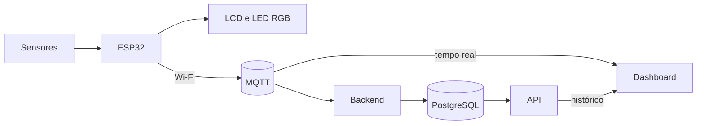

<div align="center">

# Aeolus

### Estação meteorológica com internet das coisas (IoT)

Mede temperatura, umidade, luz e vento, e mostra tudo em tempo real.


Projeto do Programa de Estágio em IoT · Vortex Lab · UNIFOR

</div>

---

## Sobre o projeto

O Aeolus é uma estação que mede o clima e envia os dados pela internet para uma página web (a dashboard).

O nome vem de Éolo, o guardião dos ventos na mitologia grega. Esse tema aparece em todo o projeto:

- **O Odre de Aeolus**: a caixa que guarda a eletrônica
- **Templo de Aeolus**: a dashboard
- **Escala Aeolus**: os nomes e as cores da força do vento

## O que a estação mede

| O quê | Como |
|---|---|
| Temperatura e umidade | Sensor DHT22 |
| Luz do ambiente | Sensor LDR, com valor estimado em lux |
| Velocidade do vento | Anemômetro impresso em 3D, com encoder |
| Direção do vento | Biruta impressa em 3D, com encoder |

## Como funciona



1. Os sensores medem o ambiente.
2. O ESP32 lê os valores, mostra no LCD e acende o LED RGB.
3. Pelo Wi-Fi, ele envia os dados para o broker MQTT.
4. A dashboard recebe os dados na hora.
5. O backend guarda cada leitura no banco PostgreSQL.
6. A API entrega o histórico para o gráfico da dashboard.

## Escala Aeolus

O LED RGB e a dashboard mostram a força do vento com nomes da mitologia.

| Velocidade | Nome | Cor |
|---|---|---|
| Parado | - | Apagado |
| Até 0,5 km/h | Aura | Azul |
| Até 1 km/h | Zéfiro | Ciano |
| Até 3 km/h | Noto | Verde |
| Acima de 3 km/h | Fúria de Bóreas | Vermelho |

Essa escala é do nosso projeto, criada para os testes do protótipo. Não é uma escala oficial de meteorologia.

## No LCD

O display mostra uma animação com o nome AEOLUS e três telas:

1. Velocidade e direção do vento
2. Temperatura, umidade e luz
3. Hora e data (sincronizadas pela internet)

Dois botões na frente da caixa: um liga e desliga o display, o outro troca de tela.

## Dashboard

A dashboard mostra:

- Temperatura, umidade e luz
- Velocidade e direção do vento (com bússola)
- Gráfico com as leituras recentes
- Situação da conexão

## Tecnologias

| Parte | O que usamos |
|---|---|
| Placa | ESP32 DevKit V4 |
| Firmware | C++ com Arduino e PlatformIO |
| Comunicação | Wi-Fi e MQTT |
| Backend | Node.js e Express |
| Banco de dados | PostgreSQL |
| Dashboard | HTML, CSS e JavaScript |
| Fabricação | Placa de circuito feita à mão e peças em impressão 3D |

## Resultados

Todas as partes foram testadas e funcionam: sensores, LCD, LED RGB, Wi-Fi, MQTT, banco de dados, API e dashboard.

Duas observações importantes:

- O valor de **lux é uma estimativa**. Não foi comparado com um luxímetro.
- A **velocidade do vento** foi testada na bancada, sem comparação com um anemômetro profissional.

## Como usar

Antes de ligar a estação:

1. Gire o anemômetro e aperte o botão dele para marcar a referência.
2. Aponte a biruta para o Norte e aperte o botão dela.

Como os sensores de giro só contam o movimento, é preciso refazer o Norte sempre que a estação for reiniciada.

## Como rodar o projeto

**Você vai precisar de:** VS Code com PlatformIO, Node.js, PostgreSQL e uma rede Wi-Fi com internet.

**1. Baixar o projeto**

```bash
git clone https://github.com/brenalemos09/aeolus-iot.git
cd aeolus-iot
```

**2. Criar o arquivo `include/credenciais.h`** com os dados da sua rede (exemplo com valores falsos):

```cpp
#define WIFI_SSID "nome_da_rede"
#define WIFI_SENHA "senha_da_rede"
```

Esse arquivo não vai para o GitHub.

**3. Enviar o firmware para o ESP32** pelo PlatformIO (Build e depois Upload).

**4. Ligar o backend**

```bash
cd backend
npm install
node server.js
```

O backend precisa de um arquivo `backend/.env` com os dados do banco. Ele também não vai para o GitHub.

**5. Abrir a dashboard:** abra `dashboard/index.html` com o Live Server do VS Code.

<details>
<summary><b>Ver a pinagem do ESP32</b></summary>

<br>

| Componente | Sinal | Pino (GPIO) |
|---|---|---:|
| DHT22 | Dados | 4 |
| LDR | Sinal analógico | 35 |
| LED RGB | Vermelho | 26 |
| LED RGB | Verde | 25 |
| LED RGB | Azul | 33 |
| LCD | SDA | 13 |
| LCD | SCL | 14 |
| Anemômetro | CLK | 16 |
| Anemômetro | DT | 17 |
| Anemômetro | Botão | 19 |
| Biruta | CLK | 21 |
| Biruta | DT | 27 |
| Biruta | Botão | 22 |
| Botão do display (liga/desliga) | Sinal | 32 |
| Botão do display (troca de tela) | Sinal | 23 |

O LCD usa o endereço I2C `0x27`.

</details>

<details>
<summary><b>Ver as mensagens MQTT e o banco de dados</b></summary>

<br>

Broker: `broker.hivemq.com` · Tópico: `aeolus/sensor/dados`

Exemplo de mensagem (valores de exemplo):

```json
{
  "temperatura": 24.5,
  "umidade": 57.1,
  "luminosidade": 18500,
  "velocidade": 0.96,
  "angulo": 45,
  "direcao": "Nordeste",
  "statusDHT": true,
  "statusWiFi": true,
  "statusMQTT": true
}
```

Tabela `leituras_aeolus`: id, temperatura, umidade, luminosidade, velocidade, angulo, direcao, status_dht e criado_em.

Rotas da API: `GET /api/status` e `GET /api/leituras`.

</details>

<details>
<summary><b>Ver como o lux é calculado</b></summary>

<br>

O LDR é lido pelo ADC do ESP32, com valores de 0 a 4095. Fizemos uma conversão linear:

| Leitura | Luz estimada |
|---:|---:|
| 3358 | 0 lux |
| 0 | 120000 lux |

```text
lux = 120000 × (3358 − leitura) ÷ 3358
```

É só uma estimativa, porque um LDR não responde de forma perfeitamente linear.

</details>

<details>
<summary><b>Ver a estrutura de pastas</b></summary>

<br>

```text
aeolus-iot/
├── backend/        servidor, MQTT e banco de dados
├── dashboard/      página web
├── include/        arquivos .h do firmware
├── src/            arquivos .cpp do firmware
├── testes-hardware/ testes de cada componente
├── platformio.ini
└── README.md
```

</details>

## O que aprendemos

- Testar cada componente sozinho antes de juntar tudo evita muitos erros.
- Funcionar não é o mesmo que estar calibrado.
- Trocar uma peça (como o LDR e a placa) pode resolver problemas que o código não resolve.
- Organizar o código em módulos e usar Git deixou o trabalho em dupla muito mais tranquilo.

## Melhorias futuras

- Calibrar o lux com um luxímetro
- Comparar a velocidade do vento com um equipamento de referência
- Fazer testes longos de funcionamento
- Guardar também o estado enviado pelo firmware, para o LED e a dashboard sempre combinarem

## Equipe

Desenvolvido por **Brena** e **Marianna**, no Vortex Lab da Universidade de Fortaleza.
